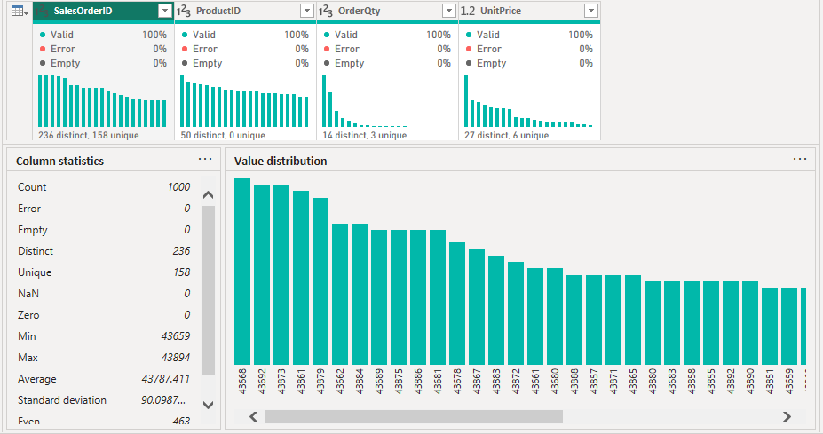
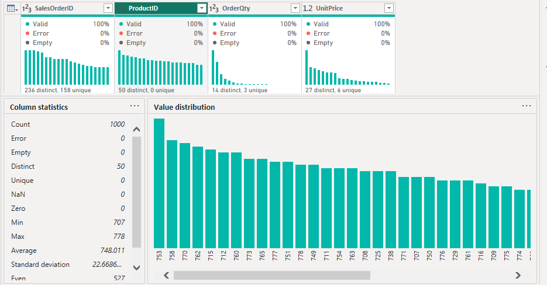
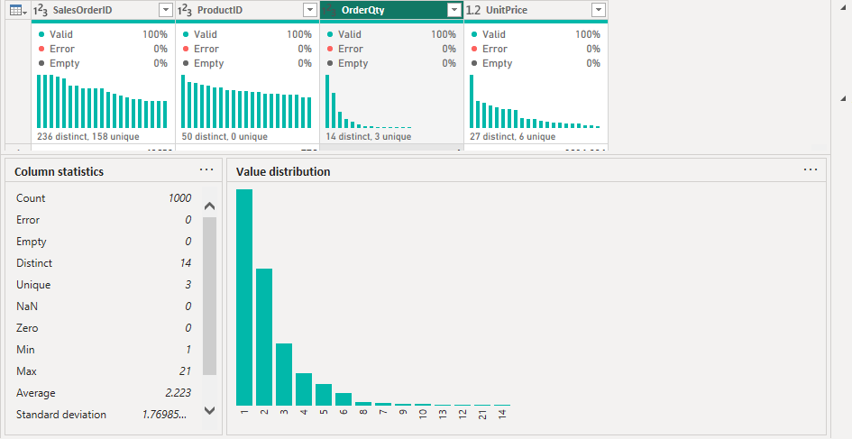
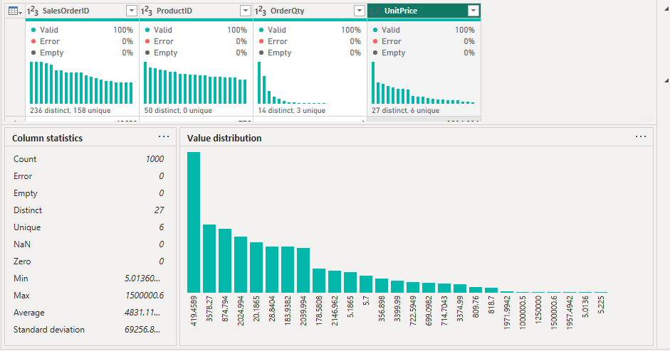
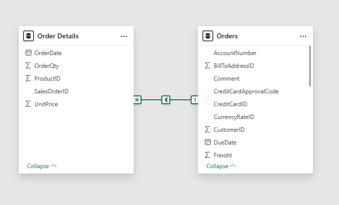
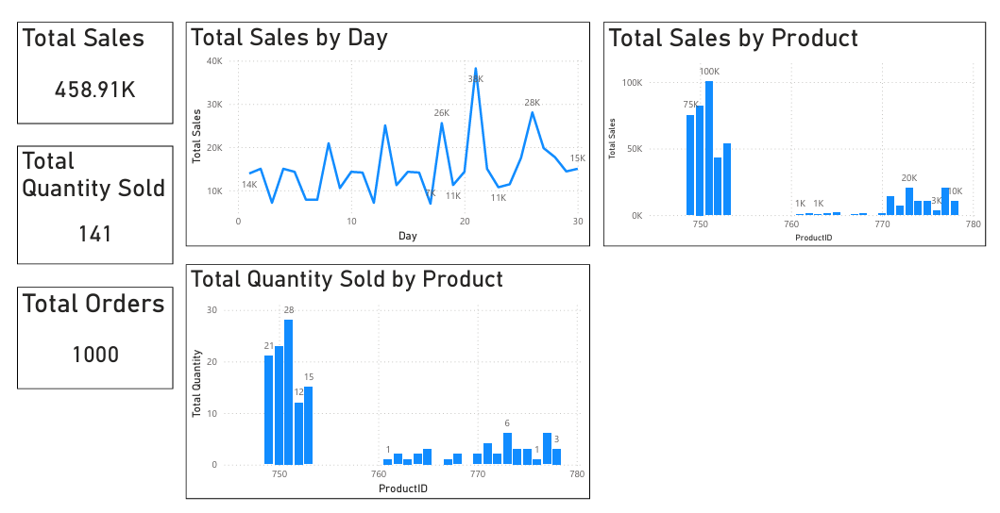

# 📶 AdventureWorks Power BI ETL Dashboard
### 🎓 Microsoft Power BI Data Analyst Specialization - Portfolio Project

---

## 📑 Table of Contents
- [📌 Overview](#-overview)
- [🎯 Business Task](#-business-task)
- [📂 Dataset Detail](#-dataset-detail)
- [🛠️ Tools & Technologies Used](#️-tools--technologies-used)
- [🧠 Skills Demonstrated](#-skills-demonstrated)
- [🔄 Project Workflow](#-project-workflow)
- [📊 Results](#-results)
- [🔍 Key Findings](#-key-findings)
- [ℹ️ About this Project](#️-about-this-project)

---

## 📌 Overview
This project demonstrates an **end-to-end ETL (Extract, Transform, Load) workflow in Power BI** using Adventure Works sales data.  
The focus is on **data cleaning, transformation, anomaly detection, data modeling, DAX measures, and dashboard creation**, following industry best practices.

---

## 🎯 Business Task
Adventure Works generates a large volume of international sales data stored across multiple yearly files.  
The objective was to:
- Clean and consolidate multi-year sales data
- Identify and remove data anomalies
- Create a reliable data model
- Build a clear and meaningful sales dashboard for decision-making

---

## 📂 Dataset Detail
The project uses **three Excel files**:

- **Order2022.xlsx** – Sales order data for year 2022  
- **Order2023.xlsx** – Sales order data for year 2023  
- **OrderDetails.xlsx** – Line-level sales details (products, quantity, price)

📁 All datasets are available in the `Dataset/` folder.

---

## 🛠️ Tools & Technologies Used
- **Power BI Desktop**
- **Power Query Editor**
- **DAX (Data Analysis Expressions)**

---

## 🧠 Skills Demonstrated
- Data extraction from multiple sources  
- Data cleaning & transformation  
- Data profiling (column quality, distribution, profile)  
- Anomaly detection & removal  
- Appending and merging datasets  
- Data modeling (relationships)  
- DAX measure creation  
- Dashboard design & visualization  

---

## 🔄 Project Workflow
This project follows a structured, end-to-end data workflow:

1. **Data Extraction**
   - Imported multiple Excel files into Power BI using Power Query.

2. **Data Transformation**
   - Removed unnecessary columns.
   - Cleaned empty and invalid rows.
   - Profiled data using column quality, distribution, and statistics.

3. **Anomaly Detection**
   - Identified extreme outliers in UnitPrice.
   - Removed incorrect values to prevent skewed analysis.

4. **Data Integration**
   - Appended Order2022 and Order2023 into a unified Orders table.
   - Merged Orders with OrderDetails using SalesOrderID.

5. **Data Modeling**
   - Created a clean one-to-many relationship between Orders and OrderDetails.

6. **Measures (DAX)**
   - Built core business measures such as Total Sales, Total Quantity, and Average Order Value.

7. **Visualization**
   - Designed a sales dashboard to summarize KPIs and trends.

---

## 📊 Results

| 1. Sales Order ID Statistics |
|-------------------------------|
|  |
| Distribution and uniqueness analysis of SalesOrderID to validate order-level data integrity across multiple years. |

---

| 2. Product ID Statistics |
|-------------------------------|
|  |
| Product-level distribution analysis used to ensure consistency and detect irregularities in product records. |

---

| 3. Order Quantity Statistics |
|-------------------------------|
|  |
| Statistical analysis of order quantities to identify abnormal values and validate sales volume accuracy. |

---

| 4. Unit Price Statistics |
|-------------------------------|
|  |
| Unit price profiling used to detect pricing outliers and remove anomalous records impacting sales metrics. |

---

| 5. Data Model |
|-------------------------------|
|  |
| One-to-many data model establishing a clean relationship between Orders and Order Details tables. |

---

| 6. Final Sales Dashboard |
|-------------------------------|
|  |
| Interactive Power BI dashboard presenting key sales KPIs, trends, and product-level performance insights. |

---

## 🔍 Key Findings
- Outlier prices significantly impacted average sales metrics and were successfully removed.
- Clean data modeling ensured accurate aggregation and analysis.
- Consolidating multi-year data improved trend visibility.
- The final dashboard provides a clear overview of sales performance.

---

## ℹ️ About this Project
This project was completed as part of the **Microsoft Power BI Data Analyst Professional Certificate**, specifically the **Extract, Transform, and Load Data in Power BI** course.  
It is designed to showcase **practical ETL, modeling, and reporting skills** in a real-world business scenario.

---
