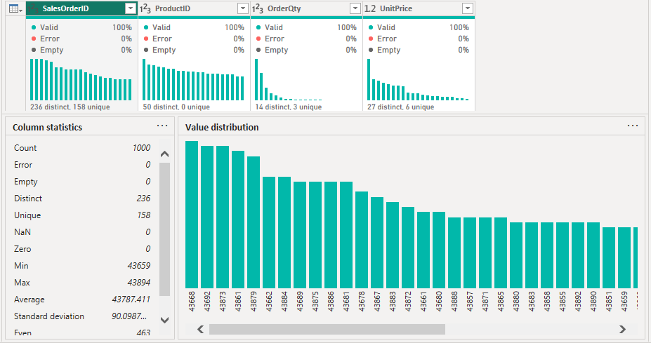
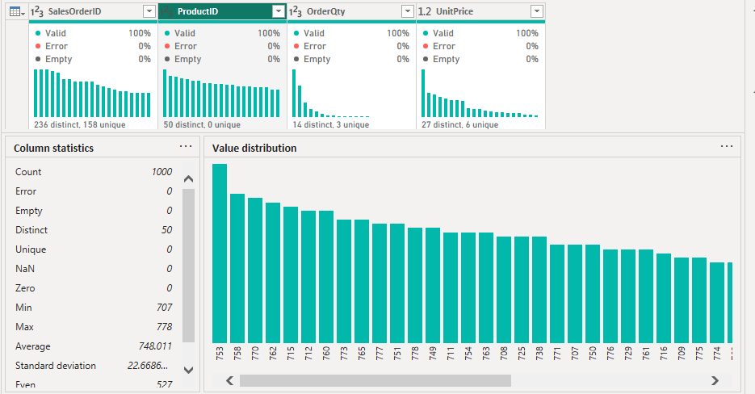
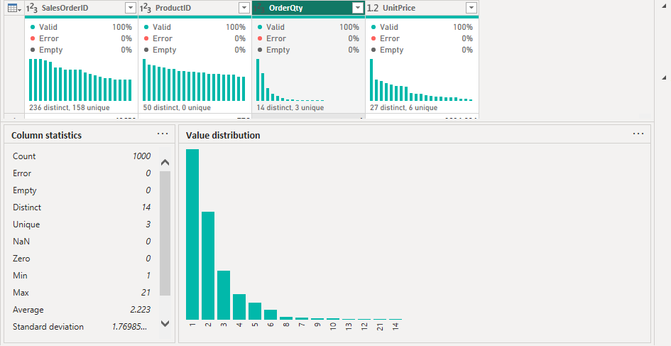
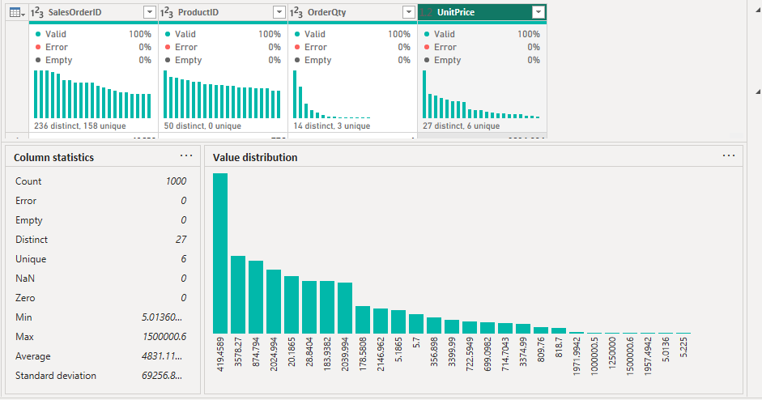
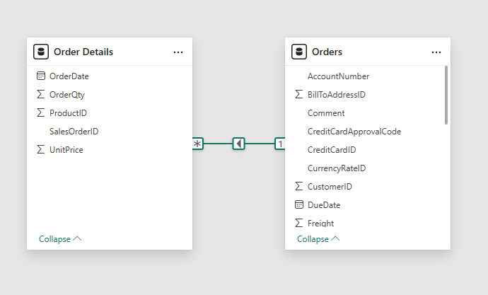
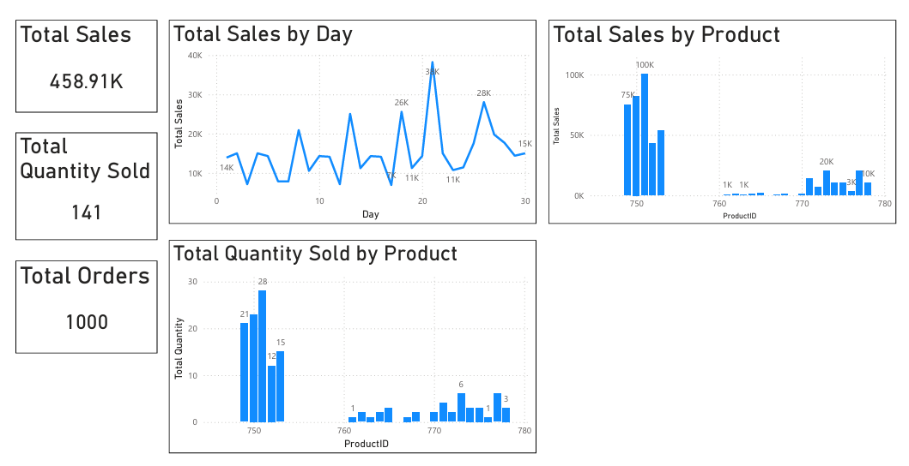

# AdventureWorks Sales ETL Pipeline & Dashboard
### Microsoft Power BI Data Analyst Specialization - Portfolio Project

---

## Table of Contents

- [Overview](#overview)
- [Business Task](#business-task)
- [Objectives](#objectives)
- [Dataset](#dataset)
- [Tools & Technologies](#tools--technologies)
- [Methodology](#methodology)
- [Data Model & DAX Measures](#data-model--dax-measures)
- [Results](#results)
- [Key Performance Indicators](#key-performance-indicators)
- [Key Findings](#key-findings)
- [About This Project](#about-this-project)

---

## Overview

This project demonstrates an end-to-end ETL (Extract, Transform, Load) workflow in Power BI using Adventure Works sales data. It covers data cleaning, transformation, anomaly detection, data modeling, DAX measure creation, and dashboard development, following industry best practices for building a reliable, decision-ready sales report from raw multi-year source files.

---

## Business Task

Adventure Works generates a large volume of international sales data stored across multiple yearly files. The objective was to:

- Clean and consolidate multi-year sales data into a single reliable source
- Identify and remove data anomalies before they distort reporting
- Create a clean, relationship-based data model
- Build a clear, meaningful sales dashboard to support decision-making

---

## Objectives

- Extract and consolidate 3 separate source files into a unified, analysis-ready dataset
- Profile and clean the data to catch anomalies before they reach the reporting layer
- Build a one-to-many data model connecting order-level and line-level detail
- Deliver core DAX measures and a dashboard that surface sales performance accurately

---

## Dataset

| File | Description |
|---|---|
| Order2022.xlsx | Sales order data for year 2022 |
| Order2023.xlsx | Sales order data for year 2023 |
| OrderDetails.xlsx | Line-level sales details (products, quantity, price) |

All datasets are available in the `Dataset/` folder.

---

## Tools & Technologies

| Category | Tools |
|---|---|
| Application | Power BI Desktop |
| Data Transformation | Power Query Editor |
| Calculations | DAX (Data Analysis Expressions) |

---

## Methodology

**1. Data Extraction**
Imported multiple Excel files into Power BI using Power Query.

**2. Data Transformation**
Removed unnecessary columns, cleaned empty and invalid rows, and profiled the data using column quality, distribution, and statistics views.

**3. Anomaly Detection**
Identified extreme outliers in UnitPrice and removed incorrect values to prevent skewed downstream analysis.

**4. Data Integration**
Appended Order2022 and Order2023 into a unified Orders table, then merged Orders with OrderDetails using SalesOrderID.

**5. Data Modeling**
Built a clean one-to-many relationship between Orders and OrderDetails.

**6. DAX Measures**
Created core business measures - Total Sales, Total Quantity, and Average Order Value.

**7. Visualization**
Designed a sales dashboard to summarize KPIs and trends across the consolidated dataset.

---

## Data Model & DAX Measures

- **Integration:** Order2022 and Order2023 appended into a single Orders table, then merged with OrderDetails via SalesOrderID.
- **Relationship:** One-to-many between Orders and OrderDetails.
- **Core DAX measures:** Total Sales, Total Quantity, Average Order Value.
- **Data quality step:** UnitPrice outliers identified and removed prior to modeling to prevent skewed metrics.

---

## Results

All screenshots in [`Results/`](./Results).

| # | Result | Screenshot |
|---|--------|------------|
| 1 | Sales Order ID statistics - distribution and uniqueness analysis validating order-level data integrity across years |  |
| 2 | Product ID statistics - product-level distribution analysis to detect record irregularities |  |
| 3 | Order quantity statistics - identifies abnormal values and validates sales volume accuracy |  |
| 4 | Unit price statistics - pricing outlier detection prior to removal |  |
| 5 | Data model - one-to-many relationship between Orders and Order Details |  |
| 6 | Final sales dashboard - key sales KPIs, trends, and product-level performance |  |

---

## Key Performance Indicators

| KPI | Result |
|---|---|
| Source Files Consolidated | 3 |
| Years of Data Unified | 2022, 2023 |
| Data Model Relationship | One-to-many (Orders → OrderDetails) |
| Core DAX Measures Built | 3 (Total Sales, Total Quantity, Average Order Value) |
| Anomaly Field Cleaned | UnitPrice (outliers removed) |

---

## Key Findings

- Outlier prices in UnitPrice significantly distorted average sales metrics before cleaning, and their removal materially improved the accuracy of downstream KPIs.
- Building a clean one-to-many relationship between Orders and OrderDetails ensured aggregation at both the order and line-item level stayed accurate rather than double-counting or under-counting.
- Consolidating 2022 and 2023 data into a single Orders table improved trend visibility, making year-over-year comparison possible in one view instead of two disconnected files.
- The final dashboard consolidates sales KPIs, trends, and product-level performance into a single, decision-ready view for stakeholders.

---

## About This Project

This project was completed as part of the Microsoft Power BI Data Analyst Professional Certificate, specifically the Extract, Transform, and Load Data in Power BI course. It is designed to showcase practical ETL, modeling, and reporting skills in a real-world business scenario.

---
